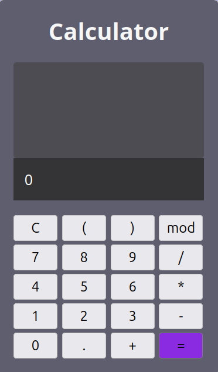

# React Calculator

A basic calculator built with React.  



---

## Features

- Basic arithmetic operations.
  - Addition (+)
  - Subtraction (-)
  - Multiplication (*)
  - Division (/)
- Modulus operation using **mod**.
- Percentage (%) calculation.
- Pi (π) input.
- Square (x²) calculation.
- Square root (√) calculation.
- Scientific functions:
  - sin (degrees)
  - cos (degrees)
  - tan (degrees)
  - log (base 10)
  - ln (natural logarithm)
- Clear (C) button to reset the display.
- Backspace support to remove the last character.
- Calculation history tracking.

--- 

## Getting Started

**1. Clone the repository:**
```bash
git clone <repo-url>
```
**2. Navigate into the project folder:**
```bash
cd react-calculator
```
**3. Install dependencies:**
```bash
npm install
```
**4. Start development server:**
```bash
npm start
```
or
```bash
npm run dev
```